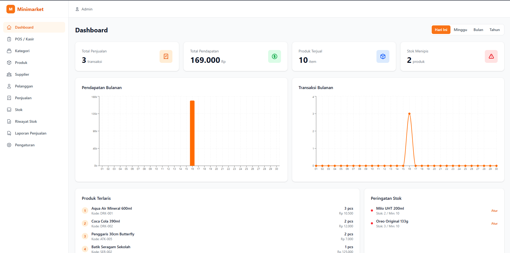
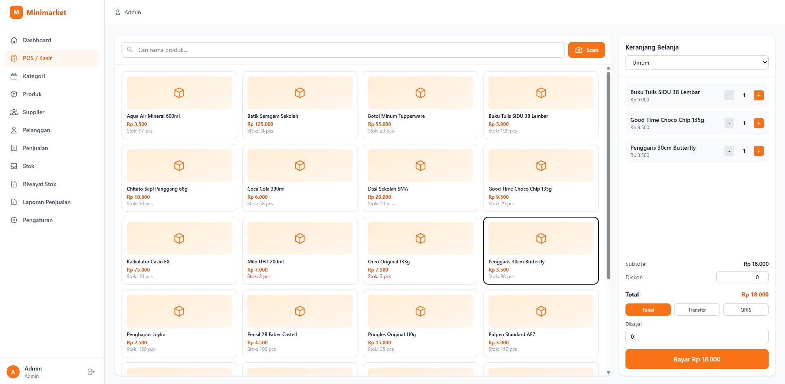
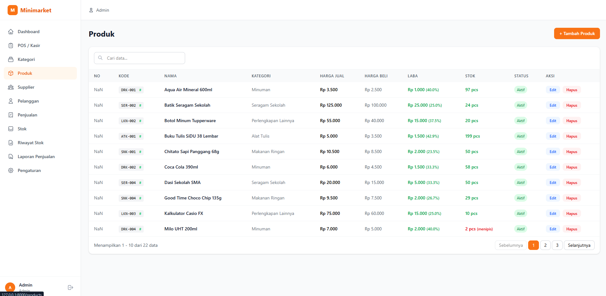
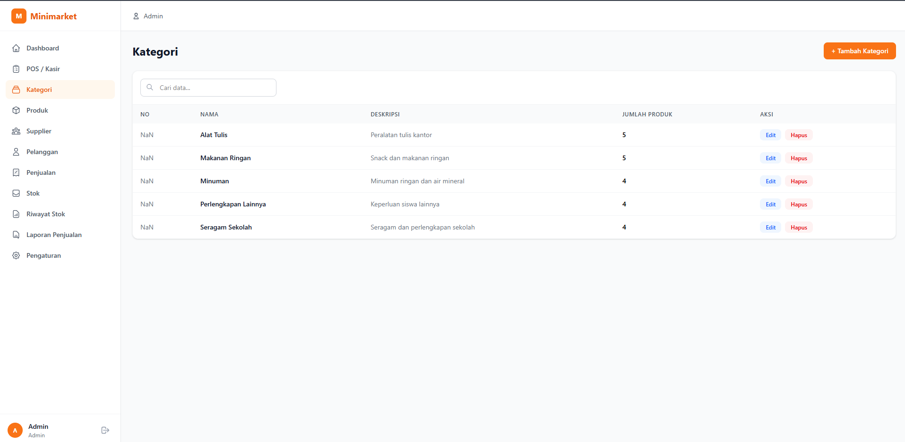
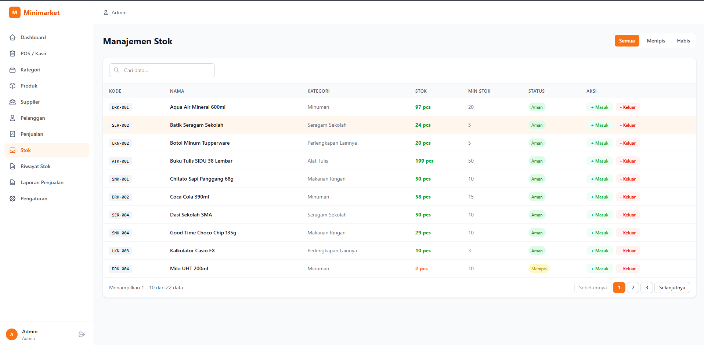
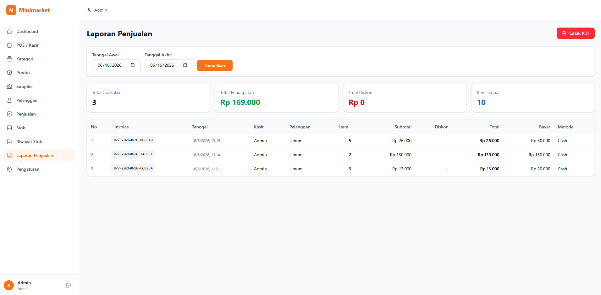
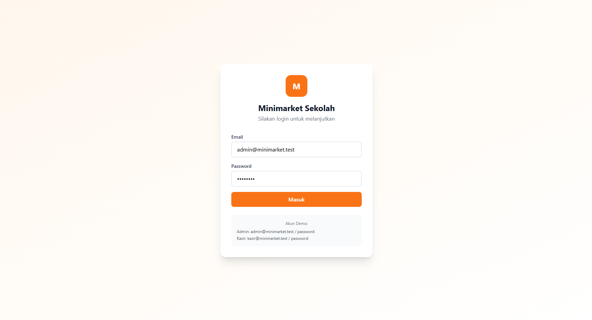
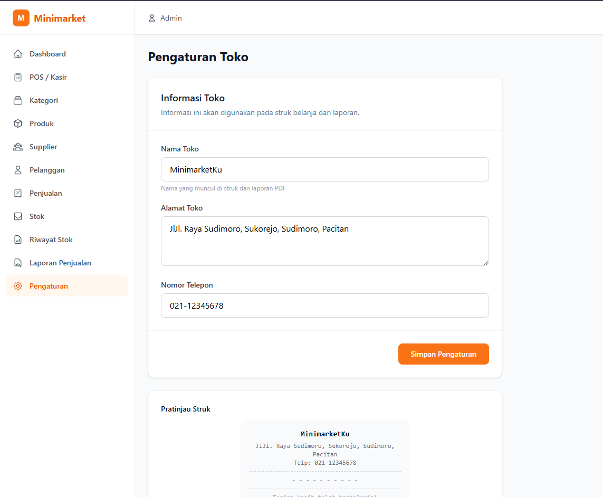

<h1 align="center">🏪 Minimarket Sekolah</h1>

<p align="center">
  Aplikasi manajemen minimarket berbasis web dengan sistem <strong>Point of Sale (POS)</strong> yang dibangun menggunakan <strong>Laravel 11</strong> (backend API) dan <strong>React 18</strong> (frontend SPA). Dilengkapi dengan manajemen produk, stok, pelanggan, pemasok, laporan penjualan, serta dukungan <strong>scan barcode/QR Code</strong> dari kamera.
</p>

<p align="center">
  
  
  
  
  
  
</p>

---

## 📸 Tangkapan Layar

<p align="center">
  <br>
  <em>Dashboard — Ringkasan bisnis dengan statistik dan grafik</em>
</p>

<p align="center">
  <br>
  <em>Point of Sale (POS) — Sistem kasir dengan keranjang belanja</em>
</p>

<p align="center">
  <br>
  <em>Manajemen Produk — CRUD produk dengan pencarian dan pagination</em>
</p>

<p align="center">
  <br>
  <em>Manajemen Kategori — Mengelompokkan produk</em>
</p>

<p align="center">
  <br>
  <em>Riwayat Penjualan & Cetak Struk — Daftar transaksi dan struk pembayaran</em>
</p>

<p align="center">
  <br>
  <em>Manajemen Stok & Mutasi Stok — Stok masuk, keluar, dan riwayat pergerakan</em>
</p>

<p align="center">
  <br>
  <em>Laporan Penjualan — Filter tanggal, ringkasan, dan cetak PDF</em>
</p>

<p align="center">
  <br>
  <em>Halaman Login — Autentikasi pengguna</em>
</p>

<p align="center">
  <br>
  <em>Pengaturan Toko — Konfigurasi informasi toko dengan pratinjau struk</em>
</p>

---

## 📋 Daftar Isi

- [Fitur-Fitur](#fitur-fitur)
  - [1. Autentikasi (Login & Register)](#1-autentikasi-login--register)
  - [2. Dashboard](#2-dashboard)
  - [3. Point of Sale (POS)](#3-point-of-sale-pos)
  - [4. Manajemen Produk](#4-manajemen-produk)
  - [5. Manajemen Kategori](#5-manajemen-kategori)
  - [6. Manajemen Pemasok (Supplier)](#6-manajemen-pemasok-supplier)
  - [7. Manajemen Pelanggan (Customer)](#7-manajemen-pelanggan-customer)
  - [8. Manajemen Stok & Mutasi Stok](#8-manajemen-stok--mutasi-stok)
  - [9. Riwayat Penjualan](#9-riwayat-penjualan)
  - [10. Laporan Penjualan & Cetak PDF](#10-laporan-penjualan--cetak-pdf)
  - [11. Pengaturan Toko](#11-pengaturan-toko)
  - [12. Scan Barcode & QR Code](#12-scan-barcode--qr-code)
- [Teknologi yang Digunakan](#teknologi-yang-digunakan)
- [Persyaratan Sistem](#persyaratan-sistem)
- [Panduan Instalasi](#panduan-instalasi)
- [Struktur Database](#struktur-database)
- [Akun Demo](#akun-demo)

---

## 🎯 Fitur-Fitur

### 1. Autentikasi (Login & Register)

Sistem autentikasi menggunakan **Laravel Sanctum** (token-based API authentication) dengan dua role pengguna:

- **Login** — Masuk menggunakan email dan password yang terdaftar.
- **Register** — Mendaftarkan akun baru.
- **Logout** — Menghapus token autentikasi saat keluar.
- **Profil** — Menampilkan data pengguna yang sedang login (`/api/me`).

### 2. Dashboard

Halaman utama yang menampilkan ringkasan bisnis secara real-time dengan kemampuan memfilter periode (**Hari Ini**, **Minggu Ini**, **Bulan Ini**, **Tahun Ini**):

- **Kartu Statistik:**
  - Total transaksi penjualan
  - Total pendapatan (dalam Rupiah)
  - Total produk terjual
  - Jumlah stok menipis
- **Grafik Pendapatan Bulanan** — Bar chart pendapatan per hari.
- **Grafik Transaksi Bulanan** — Line chart jumlah transaksi per hari.
- **Produk Terlaris** — Top 5 produk dengan penjualan terbanyak beserta jumlah dan pendapatan.
- **Peringatan Stok** — Daftar produk yang stoknya berada di bawah batas minimum, dengan tombol langsung menuju halaman stok.

### 3. Point of Sale (POS)

Sistem kasir yang cepat dan responsif untuk melakukan transaksi penjualan:

- **Pencarian Produk** — Cari produk berdasarkan nama atau kode secara real-time.
- **Grid Produk** — Tampilan grid produk dengan informasi harga, stok, dan satuan.
- **Scan Barcode/QR Code** — Scan langsung dari kamera perangkat untuk menambahkan produk.
- **Keranjang Belanja**:
  - Tambah/kurangi quantity produk (dengan validasi stok).
  - Hapus item dari keranjang.
  - Pemilihan pelanggan (default: Umum).
  - Input diskon nominal.
- **Metode Pembayaran**: Tunai, Transfer, QRIS.
- **Perhitungan Otomatis**: Subtotal, total diskon, grand total, jumlah bayar, dan uang kembalian.
- **Cetak Struk** — Setelah transaksi berhasil, struk pembayaran dapat dicetak (membuka jendela baru dengan format struk thermal).
- **Invoice Number** — Setiap transaksi memiliki nomor invoice unik.

### 4. Manajemen Produk

CRUD (Create, Read, Update, Delete) untuk data produk dengan fitur lengkap:

- **Tambah Produk**: Input nama, kode, kategori, harga jual, harga modal, stok awal, stok minimum, satuan (`pcs`, `kg`, `liter`, dll.), deskripsi, dan upload gambar.
- **Edit Produk**: Mengubah data produk yang sudah ada.
- **Hapus Produk**: Menghapus produk dari database.
- **Search & Pagination**: Pencarian berdasarkan nama/kode dengan pagination 10 data per halaman.
- **Cari Berdasarkan Barcode** — Input kode barcode untuk mencari produk secara cepat.
- **Scan Barcode** — Scan barcode/QR dari kamera untuk mencari produk.
- **Aktif/Nonaktifkan** — Setiap produk memiliki status aktif/nonaktif yang memengaruhi tampilan di POS.
- **Manajemen Stok** — Update stok produk secara manual.

### 5. Manajemen Kategori

Mengelompokkan produk ke dalam kategori-kategori tertentu:

- **CRUD kategori** — Tambah, edit, hapus kategori.
- **DataTable** — Tampilan tabel dengan search dan pagination.
- **Referensi Produk** — Kategori digunakan saat input produk dan di halaman POS.

### 6. Manajemen Pemasok (Supplier)

Mencatat data pemasok/distributor produk:

- **CRUD supplier** — Tambah, edit, hapus data pemasok.
- **Informasi Lengkap** — Nama, alamat, telepon, email.
- **DataTable** — Tampilan tabel dengan search dan pagination.

### 7. Manajemen Pelanggan (Customer)

Mencatat data pelanggan yang berbelanja:

- **CRUD customer** — Tambah, edit, hapus data pelanggan.
- **DataTable** — Tampilan tabel dengan search dan pagination.
- **Digunakan di POS** — Memilih pelanggan saat transaksi.

### 8. Manajemen Stok & Mutasi Stok

Melacak pergerakan stok barang:

- **Stok Masuk (Stock In)**: Mencatat penerimaan stok dari pemasok (dengan pilihan supplier).
- **Stok Keluar (Stock Out)**: Mencatat pengeluaran stok (misal: rusak, kadaluarsa, hilang).
- **Daftar Mutasi Stok**: Riwayat lengkap semua pergerakan stok (masuk/keluar) dengan detail produk, quantity, keterangan, dan tanggal.
- **Peringatan Stok Menipis**: Menampilkan produk-produk dengan stok di bawah batas minimum.

### 9. Riwayat Penjualan

Melihat semua transaksi penjualan yang telah terjadi:

- **DataTable** — Tabel penjualan dengan informasi invoice, tanggal, kasir, pelanggan, jumlah item, subtotal, diskon, total, bayar, dan metode pembayaran.
- **Search & Pagination** — Cari berdasarkan nomor invoice, filter per halaman.

### 10. Laporan Penjualan & Cetak PDF

Fitur pelaporan untuk analisis bisnis:

- **Filter Rentang Tanggal** — Pilih tanggal awal dan akhir laporan.
- **Ringkasan Laporan**:
  - Total transaksi
  - Total pendapatan
  - Total diskon yang diberikan
  - Total item terjual
- **Tabel Detail** — Daftar transaksi lengkap dalam rentang tanggal yang dipilih.
- **Cetak PDF** — Unduh laporan dalam format PDF menggunakan **DomPDF** dengan desain rapi yang siap dicetak.

### 11. Pengaturan Toko

Mengatur informasi toko yang akan muncul di berbagai tempat:

- **Nama Toko** — Nama yang muncul di struk dan laporan PDF.
- **Alamat Toko** — Alamat untuk struk dan laporan.
- **Telepon** — Nomor telepon yang ditampilkan.
- **Pratinjau Struk** — Live preview tampilan struk berdasarkan pengaturan yang diinput.

### 12. Scan Barcode & QR Code

Fitur scan menggunakan kamera perangkat yang terintegrasi di beberapa halaman:

- **Library**: `html5-qrcode` — Mendukung berbagai format: QR Code, EAN-13, EAN-8, CODE-128, CODE-39, CODE-93, UPC-A, UPC-E, CODABAR, ITF, Data Matrix, Aztec, PDF-417.
- **Digunakan di**:
  - **Halaman POS** — Menambahkan produk ke keranjang dengan scan barcode.
  - **Halaman Produk** — Mencari produk berdasarkan barcode/QR Code.
- **Input Manual** — Jika kamera tidak tersedia, tersedia input manual untuk kode barcode/QR.

---

## 🛠 Teknologi yang Digunakan

### Backend
- **Laravel 11** — PHP Framework
- **Laravel Sanctum** — API Authentication (token-based)
- **Eloquent ORM** — Database ORM
- **Database Migrations** — Struktur database terkelola
- **DomPDF** — Generate laporan PDF
- **MySQL** — Database management system

### Frontend
- **React 18** — Library JavaScript untuk UI
- **React Router DOM v7** — Routing SPA
- **Vite 6** — Build tool dan dev server
- **Tailwind CSS 4** — Utility-first CSS framework
- **Axios** — HTTP client untuk komunikasi API
- **Recharts** — Library grafik (bar chart, line chart)
- **SweetAlert2** — UI dialog/konfirmasi yang interaktif
- **html5-qrcode** — Library scan barcode/QR Code dari kamera

---

## 💻 Persyaratan Sistem

- **PHP** ≥ 8.2
- **Composer** ≥ 2.x
- **Node.js** ≥ 18.x
- **NPM** ≥ 9.x
- **MySQL** ≥ 8.0 (atau MariaDB)
- **Web Browser** modern (Chrome, Firefox, Edge, Safari) — *diperlukan izin kamera untuk fitur scan*
- **Ekstensi PHP**: `BCMath`, `Ctype`, `Fileinfo`, `JSON`, `Mbstring`, `OpenSSL`, `PDO`, `Tokenizer`, `XML`, `GD` atau `Imagick` (untuk DomPDF)

---

## 📦 Panduan Instalasi

Ikuti langkah-langkah berikut untuk menjalankan aplikasi ini di lingkungan lokal Anda.

### 1. Clone Repository

```bash
git clone https://github.com/username/minimarket.git
cd minimarket
```

### 2. Instal Dependensi Backend (Composer)

```bash
composer install
```

### 3. Salin File Environment

```bash
cp .env.example .env
```

### 4. Konfigurasi Database

Buka file `.env` dan sesuaikan konfigurasi database:

```dotenv
DB_CONNECTION=mysql
DB_HOST=127.0.0.1
DB_PORT=3306
DB_DATABASE=minimarket
DB_USERNAME=root
DB_PASSWORD=
```

Konfigurasi lainnya yang dapat disesuaikan:

```dotenv
APP_NAME=MinimarketSekolah
APP_URL=http://localhost:8000
```

### 5. Generate Application Key

```bash
php artisan key:generate
```

### 6. Instal Dependensi Frontend (NPM)

```bash
npm install
```

### 7. Buat Database

Buat database MySQL dengan nama `minimarket` (atau sesuai konfigurasi di `.env`):

```bash
mysql -u root -p -e "CREATE DATABASE minimarket;"
```

Atau menggunakan tool seperti phpMyAdmin, Laragon, XAMPP, etc.

### 8. Jalankan Migration & Seeder

```bash
php artisan migrate --seed
```

Perintah ini akan:
- Membuat semua tabel database (users, categories, products, suppliers, customers, sales, sale_items, stock_movements, settings)
- Mengisi data awal (akun admin, kategori default, pelanggan "Umum", pengaturan toko default)

### 9. Buat Storage Link

```bash
php artisan storage:link
```

### 10. Kompilasi Asset Frontend

Untuk development (dengan hot reload):

```bash
npm run dev
```

Untuk production:

```bash
npm run build
```

### 11. Jalankan Server

Jalankan server Laravel:

```bash
php artisan serve
```

Akses aplikasi di: **http://localhost:8000**

---

## 🚀 Menjalankan Aplikasi (Development)

Jalankan **kedua perintah berikut secara bersamaan** di terminal terpisah:

**Terminal 1** — Backend (Laravel):
```bash
php artisan serve
```

**Terminal 2** — Frontend (Vite dev server):
```bash
npm run dev
```

Atau menggunakan **Concurrently** (sudah tersedia di `package.json`):
```bash
composer run dev
```

Lalu buka **http://localhost:8000** di browser.

---

## 🗄 Struktur Database

Aplikasi ini memiliki tabel-tabel utama sebagai berikut:

| Tabel | Deskripsi |
|-------|-----------|
| `users` | Data pengguna/kasir |
| `categories` | Kategori produk |
| `products` | Data produk (nama, kode, harga, stok, gambar, dll) |
| `suppliers` | Data pemasok |
| `customers` | Data pelanggan |
| `sales` | Transaksi penjualan (header) |
| `sale_items` | Item detail dari setiap transaksi |
| `stock_movements` | Riwayat mutasi stok (masuk/keluar) |
| `settings` | Pengaturan toko (nama, alamat, telepon) |
| `personal_access_tokens` | Token autentikasi Sanctum |

---

## 👤 Akun Demo

Setelah menjalankan `php artisan migrate --seed`, akun default yang tersedia:

| Email | Password | Role |
|-------|----------|------|
| `admin@minimarket.test` | `password` | Admin/Kasir |

---

## 🔒 API Routes

Aplikasi ini menggunakan arsitektur SPA dengan **Laravel API Routes** (`/api/`). Beberapa endpoint utama:

### Public
- `POST /api/login` — Login
- `POST /api/register` — Register

### Protected (memerlukan token Sanctum)
- `POST /api/logout` — Logout
- `GET /api/me` — Data user
- `GET /api/dashboard` — Data dashboard (stats, charts, top products)
- `GET /api/categories` — List kategori
- `GET /api/products` — List produk (dengan search & pagination)
- `GET /api/products/barcode/{code}` — Cari produk berdasarkan barcode
- `GET /api/suppliers` — List pemasok
- `GET /api/customers` — List pelanggan
- `POST /api/sales` — Buat transaksi baru
- `GET /api/sales/today` — Transaksi hari ini
- `GET /api/sales/{id}/receipt` — Data struk transaksi
- `GET /api/reports/sales` — Laporan penjualan (filter tanggal)
- `GET /api/reports/sales/pdf` — Download laporan PDF
- `POST /api/stock/in` — Stok masuk
- `POST /api/stock/out` — Stok keluar
- `GET /api/stock/low` — Produk dengan stok menipis
- `GET /api/stock/movements` — Riwayat mutasi stok
- `GET /api/settings` — Ambil pengaturan toko
- `PUT /api/settings` — Simpan pengaturan toko

---

## 🤝 Lisensi

Aplikasi ini adalah perangkat lunak open-source yang dilisensikan di bawah [MIT License](LICENSE).

---

<p align="center">Dibuat dengan ❤️ untuk memudahkan pengelolaan minimarket sekolah</p>